# 百度实习日记
## 0^0 一些稀碎知识写在前面~
1. bash 命令： cd -   #表示到上一个刚去过的目录(不是上级目录)
cd /guan/
cd /xiong/
cd -  # 此时会回到/guan/目录下
2. 
## 实习Day1
熟悉公司制度和环境
## 实习Day2
### 1. docker的使用
docker容器可以隔离其他物理机的外部环境，根据你获取的镜像来创建容器
    a. 使用容器需要记住的一些基本要点

    ```
    docker ps  # 查看正在运行的容器，-a查看所有存在的容器
    docker images # 查看目前已经存在的镜像，镜像是容器构建的来源
    docker run -it
    ```
### virtualenv 的使用(相对于conda来看)
 virtualenv 相对轻量化一些，只需要关联python路径，新建文件，就可以得到一个虚拟环境
 具体俩看就是两条指令
 ```
 mkdir /data/py39
 virtualenv -p /usr/bin/python3.9 /data/py39
 source /data/py39/bin/activate
 ```

 ### 遗留问题
 Paddle编译时由于公司代理问题总是编译不过去，需要将Paddle 源码编译通过再来看代码。(已解决)

 ## 实习Day3
 ### paddle 自动微分机制
 不需要关注反向传播过程，只需要关注前向传播过程。
 根据forward()主动构建backward()函数
 ### paddle 的中间表示IR
 ### paddle C++算子
 用户使用飞桨开发神经网络模型时使用的 Python 接口(如 paddle.add(), paddle.relu()等) 我们一般称都为飞桨的 Python API，每个运算类的 Python API 在框架内部都会对应到一个或者多个 C++ 端算子，每个算子在不同硬件设备上（CPU, GPU 等）实现的运算逻辑代码又被称为 Kernel, 这里主要是由于不同硬件设备提供的编程接口不同，所以虽然同一个算子的不同硬件设备 Kernel 都实现了相同的数学运算逻辑，但在代码实现上却有所差异。算子 InferMeta 函数是在算子 kernel 执行前先将输出结果的维度、数据类型等信息进行处理，由于计算量较小所以可以直接在 CPU 上计算，因此每个算子只需要实现一个 InferMeta 函数，而不必像 Kernel 一样在不同硬件上实现多个。
 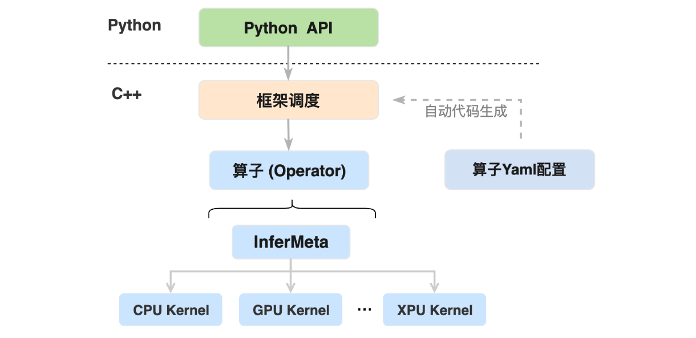
 Python API、算子 Yaml 配置、算子 InferMeta 函数 和算子 Kernel 之间的关系如上图所示，最上层为用户使用的飞桨 Python API 接口，Python API 执行时会进入到 C++ 端由框架进行调度并执行相应的算子逻辑，算子的执行主要包括两个过程：

（1）执行算子 InferMeta 函数完成输出结果的维度、数据类型等静态信息的推导。

（2）根据输入变量的设备信息选择对应的硬件设备来执行算子 Kernel，完成输出结果的数值计算。

## 实习Day4 正式开始学习飞浆分布式训练
分布式编程中相比单卡多考虑的因素：并行策略、组网时对通信的处理 和 通信方式。
### 并行策略
#### (1) 数据并行
顾名思义，数据并行是在数据之间实现并行，例如使用上面单卡编程的模型，假设单卡最多运行的 batch_size=32，现在用2卡实现总的 batch_size=64 的效果
#### (2) 模型并行
模型并行是在模型参数间实现并行，即将属于同一层的参数划分到不同的卡上进行并行计算，将单卡存不下的参数用多卡来存储。例如使用上面单卡编程的模型，假设单卡最多支持1.5B的参数量进行训练，则2卡可以支持近3B的参数。因为Linear3的参数量(256*10)很小，这里没有切分，只切分了Linear1和Linear2的参数。另外注意，模型并行中，多卡输入的数据要是一样的
#### (3) 流水线并行
流水线并行是在模型层间实现并行，即以层为粒度将不同的层及参数划分到不同的卡上进行并行计算，将单卡存不下的参数用多卡来存储。例如使用上面单卡编程的模型，将Linear1和Linear2切分到0号卡上，Linear3和Relu切分到1号卡上。另外注意，流水线并行中，loss层和准确率计算都在前向计算的最后1卡上，只有这张卡能获取到loss数值
#### (4) 序列并行
序列并行是在模型并行降低单卡训练参数和优化器参数显存占用的基础上，进一步减低中间变量(Activations)的显存占用

### 动态图的代码编写步骤
1. 设置一些超参数
2. 编写Dataset数据读取器类
3. 编写优化器
4. 编写模型网络结构类
5. 设置训练函数
   如何设置？
   用类创建对象的方式创建模型，损失函数，优化器，数据集，Dataloader，然后在循环当中编写epoch循环
   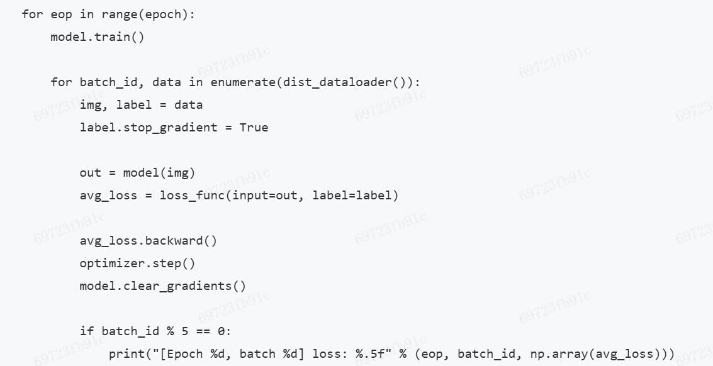
## 实习Day5
成功调通并行代码，找到了代码无法运行的原因。

继续读文档~~~~~
下班啦，年后上班再记录咯，回家接着学一下~~~~

## 实习Day6

### 6.1 今天完成一下QC考试

其中包括什么是单侧，即所谓的单元测试，测试某个最小执行单元的执行情况
其中重要的评价指标就是：覆盖率。

### 6.2 需要注意的是，全自动并行还没开发出来，后面所有说的自动并行都是半自动并行
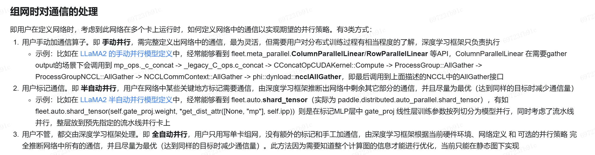

### 6.3 阅读文档遇到的一些问题
#### 问题一： ShardedDataParallel 没有写到distribute的__init__.py当中去，需要自己写入？
答：自己写入，找到源码位置

#### 问题二：Sharing, MixedPrecision,某些库文件没找到

ColumnParallel对应的哪个API

#### 问题三：API 公开的方式
1. 是这个：
paddle.distributed.parallelize(model, optimizer, mesh=None, dp_config=None, mp_config=None, pp_config=None)
2. 还是拆分后的：

paddle.distributed.parallelize_model(model, mesh=None, dp_config=None, mp_config=None, pp_config=None)

paddle.distributed.parallelize_optimizer/shard_optimizer(optimizer, mesh=None, dp_config=None, mp_config=None, pp_config=None)

3. 还是:
   新增：paddle.distributed.ShardedDataParallel(model, optimizer=None, offload=False, exclude_layer=None, mesh=None, shard_dim=None)  # 因为标记模型与优化器分开，也不需要level参数
新增：paddle.distributed.TensorParallel(model, parallelize_plan=None, mesh=None, shard_dim=None, optimizer=None)
新增：paddle.distributed.PipelineParallel(model, split_spec=None, global_spec=None, mesh=None, shard_dim=None, optimizer=None)

#### 问题四
process_mesh = ProcessMesh([[[0,1],[2,3]], [[4, 5],[6, 7]]], dim_names=["dp", "mp", "pp"])

右面有三种模式，这里为什么只给了两个数组。
#### 问题五
为什么混合并行时，可能对模型权重进行额外操作（比如：lazy初始化、AMP decorate、加载checkpoint）

### 6.4 阅读完了对应的所有文档，开始深挖Qwen2VL这个模型的自动并行方法，无论是自动并行还是手动并行都是通过调用Trainer这个东西来进行训练的，Trainer在PaddleNLP中已经实现，所以直接在这里面改对应的Qwen2VL的内容，利用中层API实现自动并行，对模型并行的内容进行打标记，具体实现内容，明天来主要学习。


## 实习Day7 
今天早上闹钟没开，上班迟到了....
彻底完成了QC测试。
误删了Paddle库，重新编译了一下。

今天捋一下git的用法！！！！！！
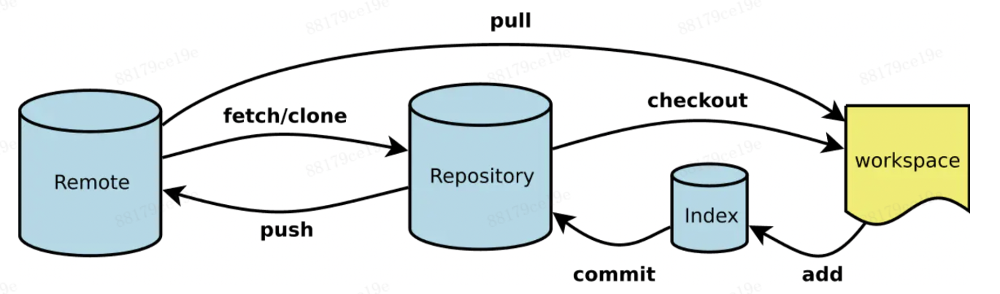
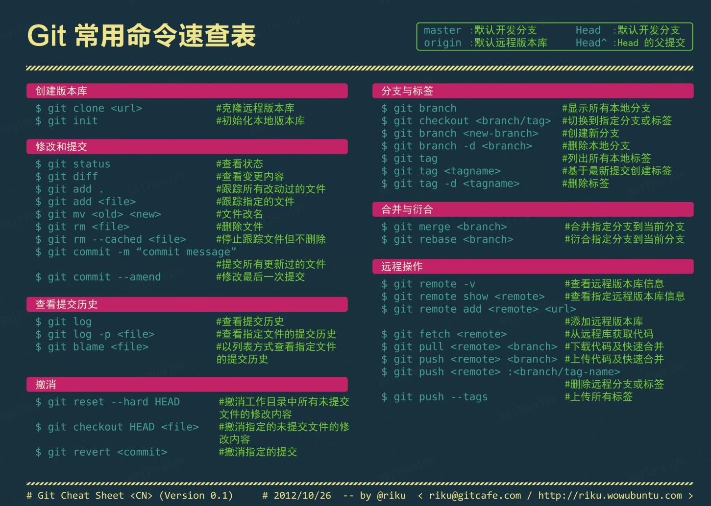

git 使用方法熟练应用。

### 1. 热启动和冷启动
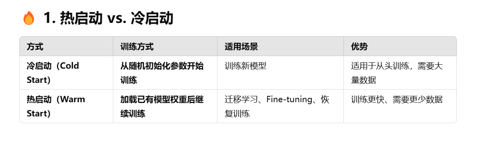
## 实习Day8

### 1. 模型蒸馏
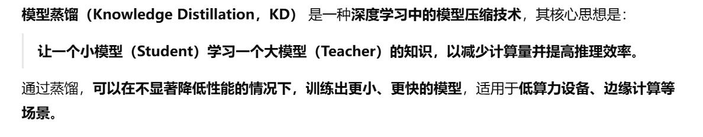
原本的大模型参数量太大，推理慢，部署困难，利用小模型学习大模型，减小参数，加快推理，类似于student学teacher。
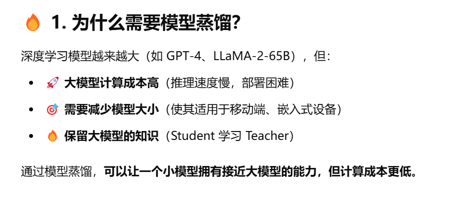

### 2. Sharding中不同的stage（1，2,3）分别代表如何切分？
在飞桨框架（PaddlePaddle）中，sharding 是一种分布式训练技术，用于优化显存使用，从而支持更大规模的模型训练。sharding 分为不同的 stage，每个 stage 代表对模型参数、梯度或优化器状态的不同程度的切分。具体来说：

stage 1：切分优化器状态。在这一阶段，每个 GPU 上只保存模型参数的一部分，而优化器状态（如动量、方差等）被切分并分散存储在不同的 GPU 上。这有助于减少单个 GPU 的显存占用。

stage 2：切分优化器状态和梯度。除了切分优化器状态外，这一阶段还进一步切分了梯度。这意味着每个 GPU 上只计算和存储与本地参数相关的梯度，进一步减少了显存的使用。

stage 3：切分优化器状态、梯度和参数。在这一最高阶段，不仅优化器状态和梯度被切分，模型参数本身也被切分。每个 GPU 上只保存和更新模型参数的一部分。这虽然增加了参数同步的通信量，但能够显著减少单个 GPU 的显存占用，从而支持更大规模的模型训练。

#### 问题： wrap_model指的是什么
答：对应的是下面的一个函数，将模型进行分布式处理。
#### 问题：wrap_model和paralell_model之间有什么关系
### 实习Day 9
学习了一下大模型原理，以及一些乱七八糟的东西
跑了一下Qwen2——VL的自动并行，调试。
### 实习Day 10
着手开始跑qwen2-VL LoRA 的中层API自动并行，并于手动并行进行对比，不知道什么原因，手动并行无法跑通
### 实习Day11 
继续跑LoRA手动并行代码，找出原因。

语言模型头:
✅ 将 Transformer 输出的隐藏状态映射到词汇表概率分布


运行之后优化器不运行，loss值为nan，learning_rate 为0.0 
正在找结果。
### 实习Day12
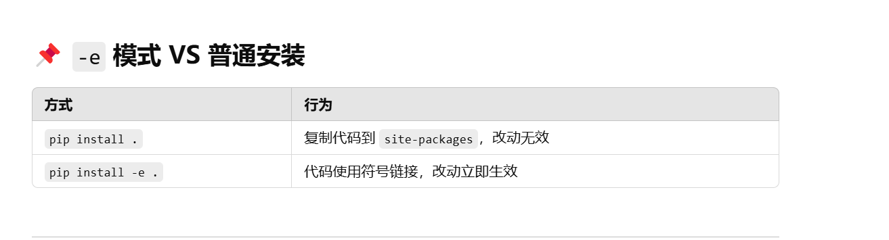

#### lora 和Quick_lora 的区别？ 一个是先linear再merge，一个是先merge再linear？

#### git 如何拉取对应的PR?
首先先同步一下远程仓库：
git pull origin（origin是远程仓库的名字） 

git fetch origin pull/1007/head:pr-1007

git remote -v 查看远程仓库和名字
git pull x(远程仓库名字，origin或者upstream) （指定分支）

在 git pull 的过程中，本地有修改，导致pull的时候 pull不下来，应该怎么解决？

git stash push filename # 可以保存指定文件而不保存所有本地修改
1. 利用  git stash 先将本地修改缓存到某个地方。
2. 然后再git pull origin或者upstream
3. 最后再git stash pop将本地修改弹出，即可再把本地修改加上。
   
git diff filename #查看修改了但没有git add的文件
git diff --staged filename # 查看已经git add 的，但没有git commit 的文件

修改本地分支默认远程仓库用于push到你想push的远程仓库
git branch --set-upstream-to=gb/develop

删除远程分支
git push origin --delete change_md<分支名>

强制推送远程分支，可以取消ahead的commit，并且同步落后的上游仓库的commit
git reset --hard upstream/develop

git push --force gb develop

这两个结合使用，先reset，然后再强行push

取消所有未add的所有本地修改：
git checkout . 
:-是bash里面的默认语法
### 实习Day13
调通bug，能够运行
### 实习Day14

### 3月5日实习日记(实习Day n...)
终端传输文件需要用到 命令scp
一般用法
```
scp local_file user@remote_ip:/remote/path/
```

终端tar用法：
```
解压缩： tar -xvf file_name  (x:extract)
压缩： tar -cvf file_name  (c:create)
```

ifconfig 目前已经逐步被 ip所取代了，现在的系统当中已经不安装ifconfig了

以后直接用ip吧

ip addr（管理 IP 地址）

1. 查看所有网卡地址：
ip addr show
2. 添加/删除 IP 地址：
ip addr add 192.168.1.100/24 dev eth0
ip addr del 192.168.1.100/24 dev eth0
ip link（管理网络设备）
3. 查看网卡状态：
ip link show
4. 启用/禁用网卡：
ip link set eth0 up
ip link set eth0 down
ip route（管理路由表）
5. 查看路由表：
ip route show
6. 添加/删除默认网关：
ip route add default via 192.168.1.1
ip route del default via 192.168.1.1

ls -lh   # 查看文件详细信息和内容大小
### 3月6日学习日记(认真重新学习一下atten和flash atten)

### 3月7日学习日记
开发机传文件，直接用python的server服务

命令：
```
python -m http.server
```
linux 系统下利用python 启动某个文件夹下的系统http服务，可以生成网页链接访问这个文件目录并通过http下载，实现了简单的不同开发机的文件上传
### 3月10日学习日记
### 3月13日学习日记
记录self attention的学习内容

attention的主要原理公式就是下面这个公式：
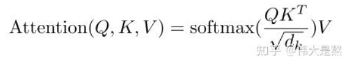
如何理解这个公式比较重要，首先你要知道用来做self attention的输入矩阵到底是什么，为什么到了公式里面就只剩QKV了？ QKV是怎么来的？

QKV是从输入时的hidden_states 来的，这里的hidden_states 的shape 为[b,s,h]，其中b是batch，及样本批次，s是sequence ，及序列长度，h 是embeding的长度。把这个矩阵简称为H，那么 Q = H*W_q+b, K = H*W_k+b , V= H*W_v +b，这么做的，知乎上是这么解释的

“为了提升模型的拟合能力，矩阵W都是可以训练的，起到一个缓冲的效果”
这里QKV是三个一模一样的矩阵，Q是查询队列，K是查询的键值，即包含自己在内的序列中的其他embeding，做点积即可得到向量间的相似度，然后再做softmax得到向量针对其他向量的分数，这里的dk是每个注意力头分得的向量维度，防止softmax时不同向量数值梯度过大，然后再乘以V，相当于利用多头的注意力矩阵做加权和，得到一个新的序列矩阵，把所有头的注意力结果按照向量维度拼接起来，即得到复原后的矩阵O与hidden_states维度相同[s,h]，b先不考虑。

矩阵O还需要经过一个线性层proj，这个线性层的作用是学习多头注意力拼接的特征，让拼接后的O矩阵过了proj之后，“拼接效果更好”，多个头融合的效果更好，然后主要是增加注意力机制的非线性能力。


最后logits和label的结果为什么要偏移？

### 3月18日
paddlenlp提交代码前的pre-commit 进行代码检查，格式检查

##### Install and register `pre-commit` in the project folder
pip install pre-commit && pre-commit install

##### Process previous code files separately
pre-commit run --file XXXX.py
### 3月19日学习日记
#### 重温Flash Attention
简单来说就是两点，主要时对，QKV矩阵分块，重要的是KV矩阵的分块，这样内存占用更小，直接存储在SRAM中，直接用于计算最终的O矩阵，然后再参存储到HBM当中去。

机智的一点是他softmax的分块计算
#### KV-Cache
主要用于推理时，每推理一个token，标准flash-attention中就要重新计算所有token的KV矩阵，这是没必要的，所以KV-Cache用于存储之前计算过的token的KV矩阵，之后每次推理新token时，只需要计算上一个新token的K，V矩阵就可以了
#### 变长的Flash_Attention
主要与Flash atten的区别为Flash atten是QKV固定分块加载进入SRAM，每次分块都一样，而变长的Flash_Attention是动态的对QKV矩阵进行分块，每次分块都不一样

### 3月20学习日记
合了两个PR
然后疯狂学习git~~~
#### git reset 和 rebase的区别
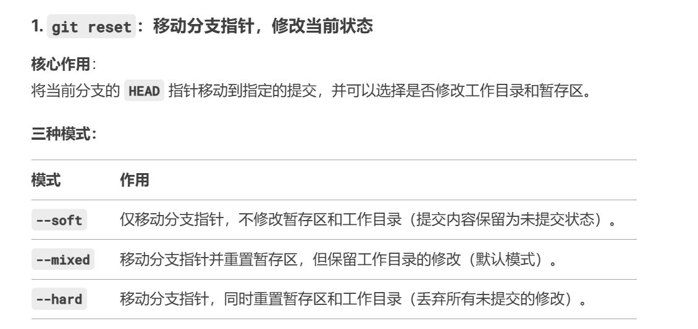
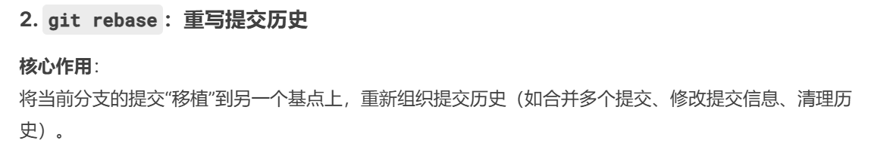

### 3月24学习日记
### 3月25学习日记
sparse ops 算子的存储方式:
在稀疏矩阵（sparse matrix）的表示中，sparse_coo（COO 格式）和 sparse_csr（CSR 格式）是两种常见的存储格式。它们都是为了提高存储和计算效率而设计的，但它们适用于不同的场景，具体的区别如下：

1. Sparse COO (Coordinate Format)
结构：
COO格式通过三个数组来表示稀疏矩阵：
row indices：一个数组，包含每个非零元素所在的行索引。
column indices：一个数组，包含每个非零元素所在的列索引。
values：一个数组，包含每个非零元素的值。

2. Sparse CSR (Compressed Sparse Row Format)
结构：
CSR格式通过三个数组来表示稀疏矩阵：
values：包含所有非零元素的值。
column indices：包含与每个非零元素对应的列索引。
row pointer：包含一个指针数组，其中每个元素表示该行的起始非零元素在values和column indices中的索引。